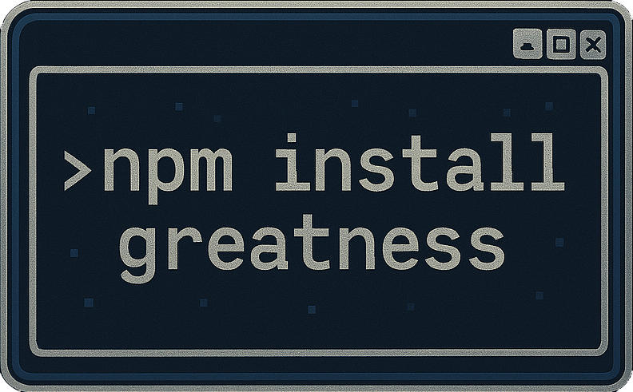

# Fall In!

<div style="display: flex; justify-content: center; align-items: center; gap: 200px; margin-bottom: 20px;">
  
  
</div>


## Problem Statement

Currently, military units rely on outdated scheduling methods. This leads to miscommunication, schedule conflicts, and last minute changes. Leadership wants a centralized, user-friendly scheduling tool to streamline the scheduling process and keep unit order and discipline

## User-stories

- As a Commander:
   I want to view the finalized crew shift schedules and personnel availability.
- As a Scheduler:
   I want to assign members to shifts.
- As a Member:
   I want a user friendly calendar to view my schedule
   so I can easily manage my work and personal time.

## Overview

Fall In is a comprehensive scheduling and event management application designed to help units coordinate and manage their schedules efficiently. The application provides a user-friendly interface for creating, viewing, editing, deleting and requesting events.

## Features

- **Admin/User Authentication**: Admins maintain authority to manage the schedule
- **Chat**:
- **User Requests**:
- **Interactive Calendar**: View events in a clean, intuitive calendar interface
- **Schedule Management**: Create, edit, and delete events with ease
- **Color-Coded Events**: Different event types are color-coded for easy identification
- **Dark/Light Mode**: Toggle between dark and light themes for comfortable viewing

## Technology Stack

- **Frontend**: React, Material-UI, Day.js
- **Backend**: Node.js, Express, Knex.js
- **Database**: PostgreSQL

## Getting Started

### 📌 Prerequisites

Ensure you have the following installed:

-   [Node.js](https://nodejs.org/) (Recommended: v16+)
-   npm (comes with Node.js)
-   Git (to clone the repository)
-   [Docker](https://www.docker.com/)

#### 🔹 Clone the repository

```sh
  git clone https://github.com/Adam-Brace/Vite-Express-Template
```

#### 🔹 Navigate to the project directory

```sh
  cd Vite-Express-Template
```

#### 🔹 Run the setup script and follow the prompts

```sh
  ./setup.sh
```

### Running with Node

#### 🔹 Start the client

```sh
  npm run dev --prefix ./client
```

#### 🔹 Open a new terminal and start the server

```sh
  npm run dev --prefix ./server
```

### Running with Docker

#### 🔹 Start the application using Docker

```sh
  docker compose up --build
```

---

## 📕 Create the Database

List all running containers and copy the **CONTAINER ID** of the **postgres:latest** container:

```sh
docker ps -a
```

Access the PostgreSQL container:

```sh
docker exec -it <CONTAINER_ID> bash
```

Replace `<CONTAINER_ID>` with the copied ID.

Log in to PostgreSQL using credentials from your `.env` file:

```sh
psql -U <$USER_NAME> -p <$DATABASE_PORT>
```

Creating a database:

```sql
CREATE DATABASE <$DATABASE_NAME>;
```

Exit the PostgreSQL shell:

```sh
\q
```

---

## 🍀 Knex Migrations & Seeding

### Running Migrations & Seeds

Run `./knex.sh` to apply database migrations and seed data:

```sh
  ./knex.sh
```

This executes the following commands in order:

-   `npx knex migrate:rollback` → Rolls back the last migration batch
-   `npx knex migrate:latest` → Runs all pending migrations
-   `npx knex seed:run` → Populates the database with seed data

### Creating Migrations and Seeds

To generate new migration and seed files, run:

```sh
  ./knex.sh <migration_and_seed_name> [additional_migrations_and_seeds...]
```

For example:

```sh
  ./knex.sh roles users
```

This generates the following migration and seed files:

```sh
migrations/
├── 00_20250320193622_roles.js
├── 01_20250320193622_users.js

seeds/
├── 00_roles.js
├── 01_users.js
```

---

## 🛠 Common Issues

When running `./setup.sh`, you may encounter one of these errors:

**❌ Error:**

-   `./setup.sh: Permission denied`
-   `Unknown command. './setup.sh' exists but is not an executable file.`

**Solution:**
Run the following command to grant execute permissions to the setup script:

```sh
  chmod +x setup.sh
```

When running `./knex.sh`, you may encounter one of these errors:

**❌ Error:**

-   `./knex.sh: Permission denied`
-   `Unknown command. './knex.sh' exists but is not an executable file.`

**Solution:**
Run the following command to grant execute permissions to the knex script:

```sh
  chmod +x knex.sh
```

When running Docker with WSL, you may encounter the following error:

**❌ Error:**

`The command 'docker' could not be found in this WSL 2 distro. We recommend to activate the WSL integration in Docker Desktop settings. For details about using Docker Desktop with WSL 2, visit: https://docs.docker.com/go/wsl2/`

`We recommend to activate the WSL integration in Docker Desktop settings. For details about using Docker Desktop with WSL 2, visit: https://docs.docker.com/go/wsl2/`

**Solution:** Enable WSL Integration in Docker Desktop

-   Open Docker Desktop on Windows.
-   Go to Settings > Resources > WSL Integration.
-   Ensure your WSL 2 distribution (e.g., Ubuntu) is enabled.
-   Click Apply & Restart.

---

## ✅ Running Tests

To run tests, navigate to the appropriate directory (server or client) and run:

```sh
  npm run test
```

---

## Project Structure

```
SDI-29-CAPSTONE/
├── client/                 # frontend
│   ├── public/             # Static assets
│   └── src/                # Source code
│       ├── Components/     # React components
│       ├── Routes/         # Route components
│       ├── styles/         # CSS styles
│       └── App.jsx         # Main application component
└── server/                 # backend
    ├── db/                 # Database configuration
    ├── migrations/         # Database migrations
    ├── seeds/              # Database seeds
    └── index.js            # Server entry point
```

## Project links

-   [Wireframe / Kanban](https://github.com/users/Adam-Brace/projects/2/views/1)
-   [Github](https://github.com/Adam-Brace/SDI-29-Capstone)

## Acknowledgments

- [React Scheduler](https://scheduler.bitnoise.pl/) for the calendar component
- [Material-UI](https://mui.com/) for the UI components

## Team npm install greatness
- [Adam Brace](https://github.com/Adam-Brace)
- [Omar Fattah](https://github.com/omarfattah44)
- [Marques Johnson](https://github.com/marquesj85)
- [Jessica Hunt](https://github.com/jessicaghunt)
- [Lizmarie Mendez](https://github.com/liz-bytes)
- [Joshua Gore](https://github.com/joshgore7)
- [Jesse Baze](https://github.com/ABazing)
- [Luke Larock](https://github.com/NoofleBot)

